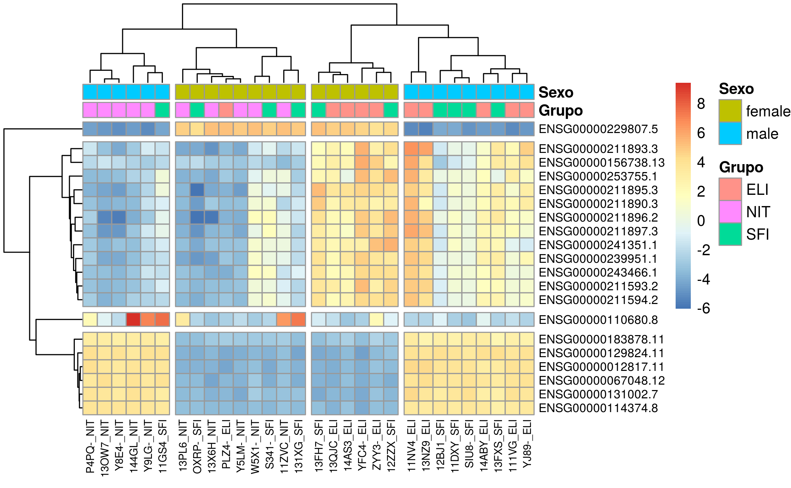

# README to "Análisis de datos de expresión (RNA-seq) en muestras de infiltración de tiroides". What is this?

This report is an exercise from the course 'Análisis de Datos Ómicos' in UOC's degree 'Bioinformática y Bioestadística'.

The exercise helped me to learn how to analyse RNA-seq data from a read counts file.  
Along the exercise I have used the language R (and the tools RStudio, Git and GitHub) for analysing changes in gene expression between healthy and pathological samples, between pathological samples of different severity, and examining the involved molecular pathways.

You can access this exercise in three formats:

[Code in R Markdown](https://github.com/jorgevallejo/RNAseq_analysis_PEC2/blob/master/RNAseq_analysis_PEC2.Rmd)

[HTML report (download)](https://github.com/jorgevallejo/RNAseq_analysis_PEC2/blob/master/results/RNAseq_analysis_PEC2.html)

[PDF report](https://github.com/jorgevallejo/RNAseq_analysis_PEC2/blob/master/results/RNAseq_analysis_PEC2.pdf)

Another thing that I learned thanks to this exercise was that one should use .Rmd (R embedded in RMarkdown formatted text) for knitting reports into HTML and .Rnw (R embedded in LaTeX) for knitting reports into PDF. It is easier that way. Since I went the difficult way, my .Rmd file is an unholy mix of RMarkdown and LaTeX.
